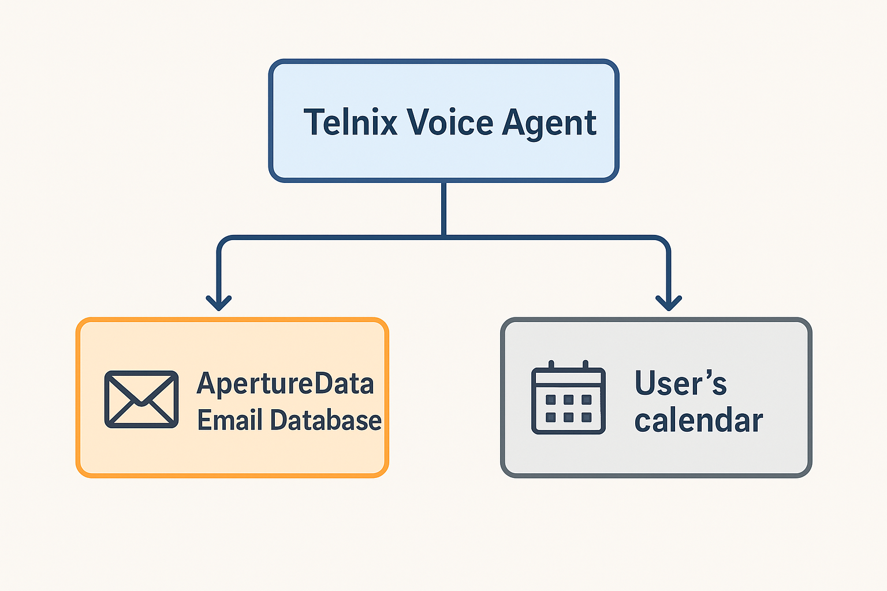

# Work Commuting Assistant

An AI-powered assistant to help you stay productive during your commute by managing emails and scheduling meetings through voice interaction.

## Overview

This agent helps you stay productive during your commute with the following capabilities:
- **Email Management**: Read unread emails, filter spam, and create summaries
- **Calendar Integration**: Access your Google Calendar, view upcoming events
- **Smart Scheduling**: Suggest and schedule meetings based on email content and availability
- **Telnyx Voice Integration**: Interact with the agent via phone calls (in progress)

## Architecture

The project uses a **Model Context Protocol (MCP) Server** integrated with **Telnyx** for voice interactions:

### Core Components

1. **MCP Gmail Server** (`mcp-gmail-main/`)
   - Gmail API integration for email operations
   - Google Calendar API integration for scheduling
   - MCP tools for email and calendar management
   - Runs as a local or remote MCP server

2. **Telnyx Agent Integration** (coming soon)
   - Voice-based interaction during commute
   - Calls MCP tools to manage emails and calendar
   - Text-to-speech for reading emails aloud
   - Speech-to-text for voice commands

### MCP Server Features

**Gmail Tools:**
- Search and read emails (with spam filtering)
- Compose and send emails
- Manage labels and email status
- Query emails with Gmail search syntax

**Calendar Tools:**
- View upcoming calendar events
- Schedule new meetings with attendees
- Find available time slots across calendars
- Suggest meeting times based on email analysis
- List all accessible calendars

**Integration-Ready:**
- No authentication layer (configure per your deployment needs)
- Environment-based configuration
- Easy to integrate with Telnyx or other voice platforms


## Quickstart

### Prerequisites

1. **Python 3.8+** installed
2. **Google Cloud Project** with Gmail and Calendar APIs enabled
   - Enable Gmail API and Google Calendar API
   - Create OAuth 2.0 credentials
3. **OAuth 2.0 Credentials** downloaded as `credentials.json`

### Setup

1. **Clone the repository**
   ```bash
   git clone <repository-url>
   cd Work-commuting-agent
   ```

2. **Navigate to the MCP Gmail server**
   ```bash
   cd mcp-gmail-main
   ```

3. **Install dependencies**
   ```bash
   pip install -r requirements.txt
   ```

4. **Set up credentials**
   - Place your `credentials.json` file in the `mcp-gmail-main/` directory
   - Copy `.env.example` to `.env` and configure as needed
   ```bash
   cp .env.example .env
   ```

### Running the MCP Server

#### Local Development

Run the MCP server locally:

```bash
cd mcp-gmail-main
uv run python -m mcp_gmail.server
```

The server will start at `http://127.0.0.1:8090` by default.

On first run, it will:
1. Open a browser window for Google OAuth authentication
2. Ask you to grant Gmail and Calendar permissions
3. Save the token to `token.json` for future use

#### Deploy with Ngrok (for Telnyx Integration)

For voice integration with Telnyx, deploy the server via ngrok:

```bash
cd mcp-gmail-main
uv run python deploy_ngrok.py
```

This will:
1. Generate a secure bearer token for API authentication
2. Start the MCP server with Bearer token protection
3. Create an ngrok tunnel to expose the server publicly
4. Display the public URL and bearer token for Telnyx configuration

**Important**: You need ngrok installed and configured:
```bash
# Install ngrok from https://ngrok.com/download
# Or via package manager (e.g., brew install ngrok)

# Configure your authtoken (get it from https://dashboard.ngrok.com)
ngrok config add-authtoken <your-token>
```

The deployment script will display:
- **Public URL**: Use this in Telnyx (e.g., `https://abc123.ngrok-free.app/sse`)
- **Bearer Token**: Use this as the API Key in Telnyx

Keep the terminal running to maintain the tunnel!

### Using the MCP Server

The MCP server exposes tools via the Model Context Protocol. Connect to it from:
- **Claude Desktop** (MCP client)
- **Telnyx AI Agent** (voice integration)
- **Custom applications** using MCP clients

**Available MCP Tools:**

**Email Management:**
- `search_emails()` - Search emails with filters (sender, subject, unread, etc.)
- `query_emails()` - Advanced search using Gmail query syntax
- `get_emails()` - Retrieve specific emails by ID
- `compose_email()` - Create a draft email
- `send_email()` - Compose and send an email
- `mark_message_read()` - Mark email as read
- `mark_as_spam()` - Mark email as spam and move to spam folder
- `list_available_labels()` - List all Gmail labels
- `add_label_to_message()` - Add a label to an email
- `remove_label_from_message()` - Remove a label from an email

**Calendar Management:**
- `get_calendar_events()` - View upcoming events
- `schedule_meeting()` - Schedule a new meeting with attendees
- `find_meeting_times()` - Find available time slots for multiple attendees
- `suggest_meeting_from_email()` - **Smart tool**: Analyze an email and suggest meeting times
- `list_all_calendars()` - List all accessible calendars

### Configuration

The server uses environment variables from `.env` in `mcp-gmail-main/`:

```env
# Server configuration
MCP_GMAIL_PORT=8090
MCP_GMAIL_HOST=127.0.0.1

# Google OAuth credentials
MCP_GMAIL_CREDENTIALS_PATH=credentials.json
MCP_GMAIL_TOKEN_PATH=token.json
```

See `.env.example` for full configuration options including Telnyx integration placeholders.

## Example Use Cases

### 1. Voice-Activated Email Check (via Telnyx)
Call the Telnyx number → "Check my unread emails" → Agent reads email summaries aloud

### 2. Smart Meeting Scheduling
"I have an email from john@example.com about a meeting" → Agent finds available times → "Schedule it for 2pm tomorrow"

### 3. Calendar Management
"What's on my calendar today?" → Agent reads upcoming events → "Add a reminder for the 3pm meeting"

## Telnyx Integration

The MCP server integrates with Telnyx AI Agents for voice interaction during your commute.

### Setup in Telnyx

1. **Deploy the MCP Server**
   ```bash
   cd mcp-gmail-main
   uv run python deploy_ngrok.py
   ```

   This will output:
   - Public URL (e.g., `https://abc123.ngrok-free.app/sse`)
   - Bearer Token (e.g., `Xy9zK...`)

2. **Configure Telnyx AI Agent**

   In the Telnyx dashboard, create an MCP Server:

   - **Name**: `Gmail Calendar MCP`
   - **Type**: Select `SSE` (Server-Sent Events)
   - **URL**: Enter the ngrok URL from step 1 (e.g., `https://abc123.ngrok-free.app/sse`)
   - **API Key**: Click "+ Append integration secret" and paste the Bearer Token

   

3. **Test the Connection**

   The Telnyx agent will automatically test the connection. If successful, you'll see the available MCP tools listed.

### Voice Commands

Once configured, you can use natural voice commands like:

**Email Management:**
- "Check my unread emails"
- "Do I have any emails from [person]?"
- "Send an email to [person] about [topic]"
- "Mark all emails from [person] as read"
- "Mark this email as spam"

**Calendar Management:**
- "What's on my calendar today?"
- "Schedule a meeting with [person] for [time]"
- "Find time to meet with [person] this week"
- "When is my next meeting?"

**Smart Scheduling:**
- "I have an email from [person] about a project meeting, suggest some times"
- "Find available slots for a 30-minute meeting with [person1] and [person2]"

### Integration Flow

```
User Call → Telnyx Voice Agent → MCP Tools → Gmail/Calendar APIs → Response → TTS → User
```

The Telnyx agent uses your MCP tools to:
1. Search and read emails
2. Check calendar availability
3. Schedule meetings
4. Manage labels and email status

All through natural voice conversation during your commute!

See `mcp-gmail-main/README.md` for detailed MCP server documentation.

## Security Notes

- **Never commit** `credentials.json`, `token.json`, `.bearer_token`, or `.env` files (they're gitignored)
- Google OAuth tokens provide full access to your Gmail and Calendar
- The ngrok deployment uses Bearer token authentication to secure the MCP endpoint
- **Bearer Token**: Treat this like a password - it grants full access to your MCP tools
- Store the bearer token securely (it's saved in `.bearer_token` file, which is gitignored)
- Use `--regenerate-token` flag to create a new token if compromised:
  ```bash
  uv run python deploy_ngrok.py --regenerate-token
  ```
- For production: Consider using ngrok's authentication features or deploy behind a reverse proxy with additional security layers

## Troubleshooting

**Issue: "Credentials file not found"**
- Ensure `credentials.json` is in `mcp-gmail-main/` directory
- Download OAuth credentials from [Google Cloud Console](https://console.cloud.google.com/apis/credentials)

**Issue: "Permission denied" for Calendar**
- Delete `token.json` and re-authenticate
- Ensure Calendar API is enabled in Google Cloud Console
- Check OAuth scopes include calendar access

**Issue: Server won't start**
- Check port 8090 isn't already in use
- Verify Python 3.8+ is installed
- Run `pip install -r requirements.txt` in `mcp-gmail-main/`

## Workflow Diagram



