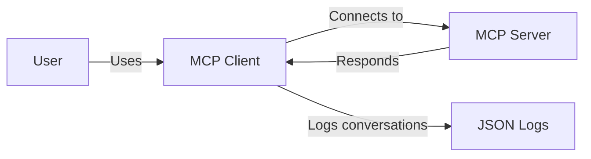
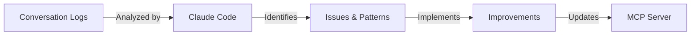
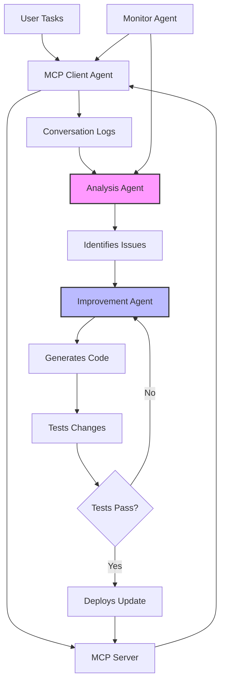

# MCP Server Improvement Workflow

> **A systematic approach to improving MCP servers using AI-driven conversation analysis**

## Overview

This document describes an innovative workflow for continuously improving Model Context Protocol (MCP) servers by analyzing real usage patterns and automatically implementing enhancements.

## Current Workflow (Manual)

### Phase 1: Usage & Data Collection



**Components:**
- **MCP Client**: Kilocode/Claude Desktop - AI agent that uses MCP tools
- **MCP Server**: Gmail & Calendar server with custom tools
- **Conversation Logs**: Stored in `%APPDATA%\Code\User\globalStorage\kilocode.kilo-code\tasks\{task-id}\api_conversation_history.json`

**What Gets Logged:**
- User requests and tasks
- Agent tool calls and arguments
- Tool results and responses
- User feedback (approvals/denials)
- Errors and warnings

### Phase 2: Analysis & Improvement



**Analysis Process:**

1. **Extract User Feedback**
   ```python
   # Look for user denials and feedback
   if 'denied this operation' in message:
       extract_feedback()
   ```

2. **Identify Search Patterns**
   - What searches were attempted?
   - How many iterations to find results?
   - What failed?

3. **Detect Pain Points**
   - Errors encountered
   - Missing features
   - Inefficient workflows

### Phase 3: Implementation

Based on analysis, implement improvements:

1. **New Tools** - Add missing functionality
2. **Enhanced Tools** - Improve existing features
3. **Better Guidance** - Update documentation/instructions
4. **Error Handling** - Fix bugs and edge cases

## Improvements Implemented

### Iteration 1: Log Analysis (`4d421c9a-98fd-4083-a180-fdcbd8f20a8d`)

**Issues Found:**
- ❌ `add_label_to_message` threw 'payload' KeyError
- ❌ Emails with only HTML returned raw tags
- ❌ Agent confused price tracking with flight bookings

**Improvements:**
```python
# Fix: Get message before modifying labels
message = get_message(service, user_id=settings.user_id, message_id=message_id)
headers = get_headers_dict(message)

# Fix: Strip HTML from email bodies
def strip_html(html: str) -> str:
    parser = HTMLToTextParser()
    parser.feed(html)
    return parser.get_text()

# New: Extract flight info from emails
def extract_flight_info(message_id: str) -> str:
    # Parse flight dates, times, airports, airlines, etc.
```

### Iteration 2: Log Analysis (`09a1844c-f54f-4d22-8638-2fb5b17435df`)

**User Feedback:**
> "But i haven't actually booked this flight, it's just a flight i was following the price of"
> "But this flight has already happened"
> "You should always examine the email contents before taking action"
> "You missed one upcoming flight from Paris to SFO"

**Improvements:**
```python
# New: Specialized flight search excluding promotions
def search_flight_bookings(...):
    query = '(booking OR confirmation) -(price OR deal OR sale)'

# Enhanced: Duplicate and past date detection
def schedule_meeting(...):
    if start_time < now:
        return "⚠️ Warning: This event is in the PAST!"

    # Check for existing similar events
    if similar_event_found:
        return "⚠️ Potential duplicate event detected!"

# New: Better search documentation
query_emails.__doc__ += """
Examples:
- Flight bookings: "(booking OR ticket) (flight OR airline) -price -deal"
- Job applications: "from:(@linkedin.com) (application OR interview)"
"""
```

### Iteration 3: Log Analysis (`345c5838-9437-4fca-a7b6-26b05a14c2a1`)

**User Feedback:**
> "Look for my upcoming flights, hint: look for emails with pdf attached to them"
> "that has no link to flights whatsoever" (after checking wrong PDF)

**Issue:** Agent used `has_attachment=true` which returned ALL attachment types (ICS, images, etc.), wasting time on irrelevant files.

**Improvements:**
```python
# New: PDF-specific attachment search
def search_emails_with_pdf_attachments(
    subject_keywords: Optional[str] = None,
    after_date: Optional[str] = None,
    ...
):
    query = f'filename:pdf subject:({subject_keywords})'
    # Returns ONLY emails with PDF attachments

# New: List and extract PDF attachments
def list_attachments(message_id: str) -> str:
    # Shows all attachments with types and sizes

def extract_pdf_text(message_id: str) -> str:
    # Reads PDF boarding passes, tickets, invoices

# Enhanced: Flight extraction now checks PDFs
def extract_flight_info(message_id: str, include_pdf_attachments=True):
    # Automatically searches email body AND PDF attachments
```

## Impact Metrics

### Before Improvements:
- 30+ searches to find all flights
- Created past events without warning
- Confused promotional emails with bookings
- Couldn't read PDF boarding passes
- Multiple duplicate calendar entries

### After Improvements:
- **1 search** finds all flight bookings
- **Automatic validation** prevents past events
- **Smart filtering** excludes promotional content
- **Full PDF support** reads boarding passes
- **Duplicate detection** prevents double-booking

## Future Vision: Fully Automated Improvement Loop



### Proposed Architecture

#### Agent 1: MCP Manager
**Responsibilities:**
- Start/stop MCP server
- Monitor health and performance
- Collect usage metrics
- Trigger analysis cycles

#### Agent 2: Analysis Agent
**Responsibilities:**
- Parse conversation logs
- Extract user feedback
- Identify error patterns
- Detect inefficiencies
- Generate improvement requirements

**Analysis Techniques:**
```python
# Pattern detection
detect_repeated_searches()  # Agent struggling to find something
detect_denials()            # User rejecting operations
detect_errors()             # Tool failures
detect_inefficiencies()     # Multiple steps for simple tasks

# Sentiment analysis
analyze_user_frustration()  # "that has no link to flights whatsoever"
detect_confusion()          # Agent making wrong assumptions
```

#### Agent 3: Improvement Agent
**Responsibilities:**
- Design solutions for identified issues
- Generate code improvements
- Write tests
- Update documentation
- Create pull requests

**Improvement Categories:**
1. **New Tools** - Missing functionality
2. **Enhanced Tools** - Better existing features
3. **Better Prompts** - Clearer instructions
4. **Bug Fixes** - Error resolution
5. **Performance** - Optimization

#### Agent 4: Testing Agent
**Responsibilities:**
- Run test suite
- Validate improvements
- Verify no regressions
- Performance testing

#### Agent 5: Deployment Agent
**Responsibilities:**
- Version management
- Safe deployment
- Rollback capability
- Update notifications

### Implementation Roadmap

**Phase 1: Semi-Automated** (Current + Next Steps)
- ✅ Manual log analysis with Claude Code
- ✅ Manual improvement implementation
- 🔄 Automated log collection
- 🔄 Automated issue detection

**Phase 2: Assisted Automation**
- 📋 Analysis agent generates improvement specs
- 📋 Human reviews and approves specs
- 📋 Improvement agent generates code
- 📋 Human reviews and deploys

**Phase 3: Full Automation**
- 📋 Continuous monitoring
- 📋 Automatic issue detection
- 📋 Automatic code generation
- 📋 Automatic testing
- 📋 Automatic deployment (with safety checks)

**Phase 4: Self-Improvement Loop**
- 📋 MCP server improves itself
- 📋 Meta-learning from improvement patterns
- 📋 Proactive feature development
- 📋 Predictive optimization

## Getting Started

### Current Manual Process

1. **Use the MCP Server**
   ```bash
   # Start MCP server
   cd mcp-gmail-main
   python -m mcp_gmail.server
   ```

2. **Perform Tasks** (using Kilocode/Claude Desktop)
   - Use various MCP tools
   - Let the agent complete tasks
   - Provide feedback when prompted

3. **Collect Logs**
   ```bash
   # Logs are automatically saved to:
   # %APPDATA%\Code\User\globalStorage\kilocode.kilo-code\tasks\{task-id}\api_conversation_history.json
   ```

4. **Analyze Logs**
   ```bash
   # Use Claude Code to analyze
   # Point Claude Code to the log file and ask it to:
   # - Extract user feedback
   # - Identify pain points
   # - Suggest improvements
   ```

5. **Implement Improvements**
   - Create new tools based on findings
   - Fix bugs and errors
   - Enhance existing functionality
   - Update documentation

6. **Test Changes**
   ```bash
   # Syntax check
   python -m py_compile mcp_gmail/server.py

   # Runtime test
   # Use the MCP server again with improvements
   ```

7. **Repeat Cycle**
   - Each iteration improves the server
   - Logs show better performance over time
   - Fewer errors and user corrections

## Best Practices

### For Log Analysis

1. **Look for Patterns, Not Single Issues**
   - Multiple users making same mistake?
   - Same search attempted repeatedly?
   - Similar feedback across sessions?

2. **Prioritize User Feedback**
   - Direct user denials = highest priority
   - "That's not what I meant" = feature gap
   - "Look deeper" = search inadequacy

3. **Measure Efficiency**
   - Count tool calls to complete task
   - Track time to success
   - Identify unnecessary steps

4. **Extract Exact Phrases**
   - User says "look for emails with PDF attachments"
   - Create tool: `search_emails_with_pdf_attachments()`
   - Match user mental model

### For Improvements

1. **Add Guardrails**
   ```python
   # Validate before acting
   if event_date < now:
       return "Error: Date is in the past"
   ```

2. **Provide Context**
   ```python
   # Show what was checked
   return f"Sources checked: {', '.join(sources)}"
   ```

3. **Guide Next Steps**
   ```python
   # Always suggest what to do next
   return result + "\n\nNext steps:\n1. Use tool_x\n2. Then tool_y"
   ```

4. **Make Errors Actionable**
   ```python
   # Not just "error", but "error and how to fix"
   return "Error: pypdf not installed. Install with: pip install pypdf"
   ```

## Conclusion

This improvement workflow transforms MCP servers from static tools into continuously evolving AI assistants that learn from real usage patterns. By systematically analyzing conversation logs and implementing targeted improvements, we create servers that become more capable and intuitive with each iteration.

The future vision of fully automated self-improvement will enable MCP servers to:
- Detect and fix their own issues
- Proactively add features users need
- Optimize based on usage patterns
- Evolve without human intervention

**Current Status**: Manual workflow with proven results
**Next Goal**: Implement analysis agent to automate issue detection
**Ultimate Vision**: Self-improving MCP ecosystem

---

*Documentation maintained as part of the Work-commuting-agent project*
*Last Updated: 2025-12-08*
